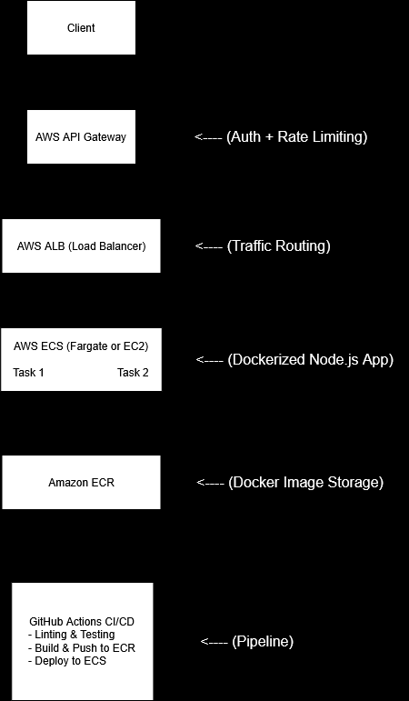

# Dummy Data API Infrastructure

## 📌 Overview
This repository contains Terraform configurations to deploy a **Node.js API** on **AWS ECS Fargate** with authentication, rate limiting, and a blue-green deployment strategy. The API generates dummy data based on user-defined fields and record counts.

## 📂 Directory Structure
```
dummy-data-api-infra/
├── terraform/                 # Terraform files for infrastructure
│   ├── main.tf                # Defines core AWS infrastructure
│   ├── variables.tf           # Input variables for Terraform
│   ├── outputs.tf             # Outputs from Terraform
│   ├── vpc.tf                 # VPC and networking setup
│   ├── ecs.tf                 # ECS cluster and service definitions
│   ├── alb.tf                 # Application Load Balancer setup
│   ├── iam.tf                 # IAM roles and permissions
│   ├── api_gateway.tf         # API Gateway configuration (Auth & Rate Limiting)
│   ├── ecr.tf                 # ECR repository for storing container images
│   ├── provider.tf            # AWS provider configuration
│   ├── backend.tf             # Remote backend configuration (S3 & DynamoDB)
│   ├── .gitignore             # Ignore sensitive files (e.g., terraform.tfvars)
├── .github/workflows/         # CI/CD pipeline (for GitHub Actions)
│   ├── deploy.yml             # Deploys the infrastructure and application
│   ├── lint.yml               # Linting, SAST, and code quality checks
├── cicd/                      # GitLab CI/CD files (if using GitLab)
│   ├── gitlab-ci.yml          # CI/CD pipeline for GitLab
├── diagrams/                  # Architecture diagram files
│   ├── architecture.png       # Detailed architecture diagram
├── README.md                  # Documentation for setup and usage
```

## 🏗️ Infrastructure Components
### **AWS Services Used:**
- **Amazon ECS (Fargate):** Runs the containerized API.
- **AWS API Gateway:** Provides authentication & rate limiting.
- **AWS ALB (Application Load Balancer):** Handles external traffic.
- **Amazon ECR:** Stores container images.
- **Amazon VPC:** Manages networking components.
- **Amazon S3 & DynamoDB:** Stores Terraform state remotely.

## 📜 Deployment Steps
### **1️⃣ Setup Terraform Infrastructure**
```sh
cd terraform
terraform init
terraform plan
terraform apply -auto-approve
```
### **2️⃣ Build & Push Docker Image**
```sh
docker build -t <your-ecr-repo-url>:latest .
docker push <your-ecr-repo-url>:latest
```
### **3️⃣ Deploy Application via CI/CD**
- **GitHub Actions:** Automatically deploys on every push.
    The .github/workflows/deploy.yml file is a GitHub Actions workflow that automates the CI/CD process for deploying the Node.js API to AWS ECS.

## 🔄 Blue-Green Deployment Strategy
1. **New version** is deployed alongside the current version.
2. Traffic shifts **gradually** from the old version to the new one.
3. If no issues occur, old version is **terminated**.

## 📊 Architecture Diagram


## 📝 Additional Notes
- **All Terraform files contain comments** to explain their purpose.
- **Sensitive credentials (e.g., AWS keys) are NOT hardcoded**; use environment variables or AWS profiles.

## 📧 Questions?
For any doubts, email: **lokeshdohare123@gmail.com**

